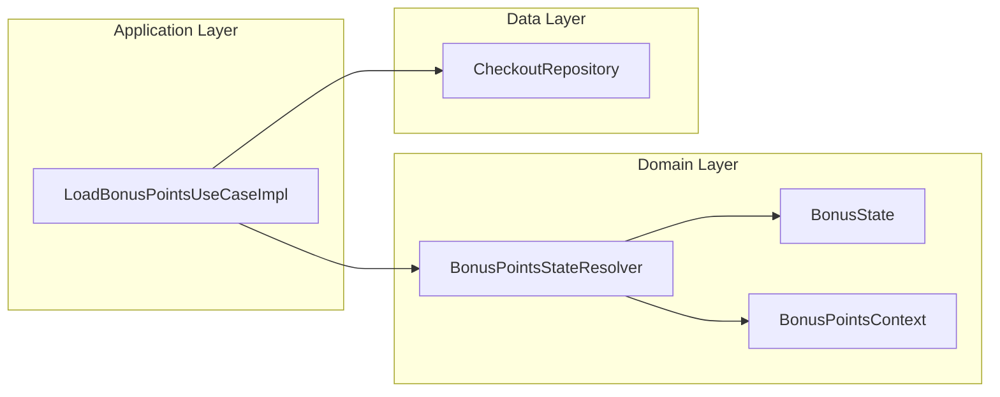
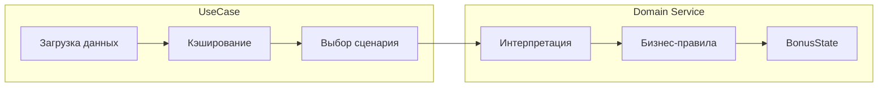
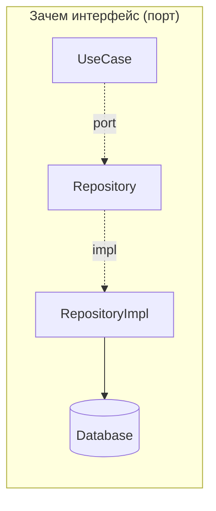
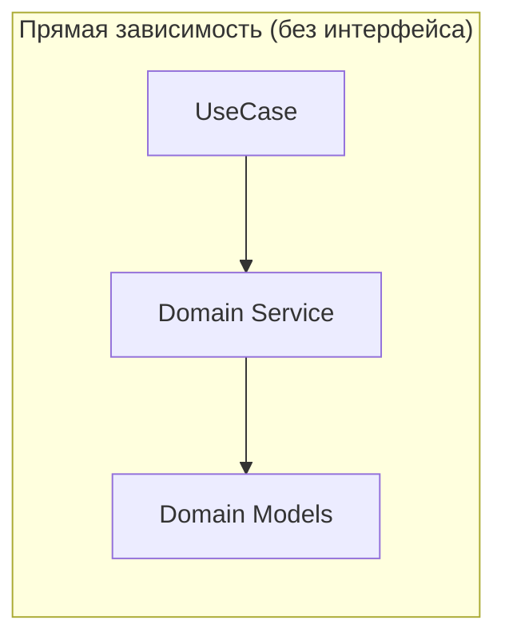
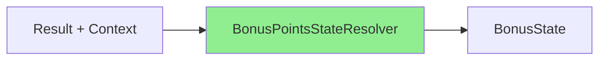
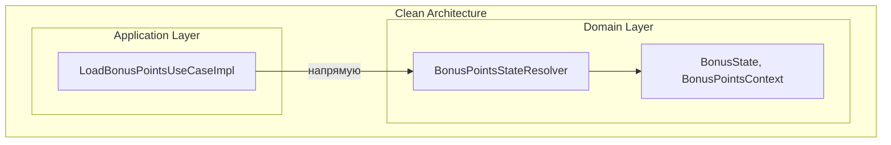

# Архитектура блока бонусных баллов: UseCase + Domain Service

## Clean Architecture (Robert C. Martin)

[](https://blog.cleancoder.com/uncle-bob/2012/08/13/the-clean-architecture.html)

> Источник: [The Clean Architecture — Uncle Bob, 2012](https://blog.cleancoder.com/uncle-bob/2012/08/13/the-clean-architecture.html)

---

## Контекст

В модуле `checkout/shared` реализована загрузка и интерпретация состояния бонусных баллов:

- `LoadBonusPointsUseCaseImpl` — Use Case (Application Layer)
- `BonusPointsStateResolver` — Domain Service (Domain Layer)

Цель документа — объяснить **почему** выделен отдельный Domain Service и **почему** ему не нужен интерфейс.

---

## Clean Architecture: два слоя бизнес-правил

На диаграмме Clean Architecture видно два слоя бизнес-правил:

| Слой | Цвет | Ответственность |
|------|------|-----------------|
| **Enterprise Business Rules** | жёлтый (Entities) | Чистые бизнес-правила, не зависящие от приложения |
| **Application Business Rules** | красный (Use Cases) | Оркестрация, специфичная для приложения |

В нашем случае:



---

## Разделение ответственностей

### LoadBonusPointsUseCaseImpl (Application Layer)

**Отвечает на вопросы: ЧТО и КОГДА**

- Решает, какие сетевые вызовы делать (параллельно или последовательно)
- Управляет кэшем результатов (`cachedIncreaseAmount`, `cachedDecreaseAmount`)
- Проверяет конфигурацию фичи (`loyaltyProgram`)
- Резолвит страну пользователя для определения лимитов
- Выбирает сценарий: `resolveInitialState` vs `resolveAction`

### BonusPointsStateResolver (Domain Service)

**Отвечает на вопрос: КАК интерпретировать**

- Преобразует `Result<BigDecimal>` в `BonusState`
- Содержит бизнес-правила: «минимум достигнут?», «лимит превышен?», «какую ошибку показать?»
- Нет побочных эффектов, нет состояния, нет IO



---

## Нужен ли резолверу интерфейс?

### Зачем вообще нужны интерфейсы в Clean Architecture?

Прежде чем ответить на вопрос про резолвер, разберёмся — какую проблему решают интерфейсы:

1. **Dependency Inversion** — внутренний слой (domain/application) не должен зависеть от внешнего (data/infrastructure). Но ему нужны данные из БД/сети. Решение: domain объявляет *порт* (интерфейс), а data предоставляет *адаптер* (реализацию).

2. **Подмена в тестах** — если класс делает IO (сеть, БД, файлы), в тестах мы хотим подставить мок. Интерфейс позволяет это сделать.

3. **Полиморфизм** — несколько реализаций одного контракта (разные провайдеры, стратегии, A/B тесты).



**Ключевое**: интерфейс нужен, когда зависимость **пересекает границу слоёв** или когда **нужна подмена реализации**.

### Применим критерии к BonusPointsStateResolver

| Критерий | Repository | BonusPointsStateResolver |
|----------|------------|--------------------------|
| Пересекает границу слоёв? | Да (application → data) | Нет (application → domain) |
| Делает IO? | Да (сеть/БД) | Нет (чистые вычисления) |
| Нужна подмена в тестах? | Да (мокаем сеть) | Нет (передаём реальный объект) |
| Несколько реализаций? | Возможно | Нет |

Резолвер:
- живёт **внутри домена** — нет пересечения границ наружу
- не делает IO — **детерминированные вычисления**
- тестируется напрямую — передаём `Result` на вход, проверяем `BonusState` на выходе



### Как выглядит тест без мока

```kotlin
@Test
fun `eligibleBelowMax returns MinimumNotReached when decreaseAmount below threshold`() {
    // Создаём реальный объект, не мок
    val resolver = BonusPointsStateResolver(minSpendingAmount = BigDecimal.TEN)

    val state = resolver.eligibleBelowMax(
        context = testContext,
        decreaseResult = Result.success(BigDecimal.fromInt(5)),
        increaseResult = Result.success(BigDecimal.fromInt(100)),
    )

    assertTrue(state is BonusState.MinimumNotReached)
}
```

Интерфейс добавил бы косвенность без пользы — мы и так передаём реальный объект.

### А если понадобится полиморфизм?

Сейчас резолвер один. Нет:
- разных стратегий резолвинга
- A/B тестов с разной логикой
- платформенных различий

Если это появится — тогда и выделим интерфейс. Интерфейс «на будущее» — преждевременная абстракция (YAGNI).

### Вывод

Сигнатуры методов резолвера (`eligibleBelowMax`, `restoredIncrease` и т.д.) — это и есть контракт. Интерфейс просто продублировал бы их без добавления ценности.

---

## Преимущества текущего решения

### Тестируемость

| Компонент | Что нужно для теста |
|-----------|---------------------|
| `BonusPointsStateResolver` | Только входные данные (`Result`, `Context`) |
| `LoadBonusPointsUseCaseImpl` | Моки: `CheckoutRepository`, `UserSession`, `ConfigFeatureInteractor` |

Резолвер покрывается unit-тестами за минуты. UseCase требует интеграционного подхода.

### Single Responsibility

```
LoadBonusPointsUseCaseImpl:
├── Проверка конфига
├── Проверка авторизации
├── Резолвинг страны → лимиты
├── Загрузка decrease/increase
├── Кэширование результатов
└── Делегирование интерпретации → Resolver

BonusPointsStateResolver:
└── Интерпретация Result → BonusState
```

### Читаемость

Все правила «когда показать ошибку», «когда Normal», «когда MaximumReaching» сосредоточены в одном файле, а не размазаны по UseCase.

### Чистота функций

Резолвер **детерминированный**: одинаковые входы → одинаковый выход.



Нет: сетевых вызовов, мутаций состояния, зависимостей на время/рандом.

---

## Итого

| Вопрос | Ответ |
|--------|-------|
| Зачем выделен `BonusPointsStateResolver`? | Разделение оркестрации (UseCase) и бизнес-правил (Domain Service) |
| Почему без интерфейса? | Не пересекает границу слоёв, не требует подмены, тестируется напрямую |
| Где граница? | UseCase знает **что/когда**, резолвер знает **как интерпретировать** |


