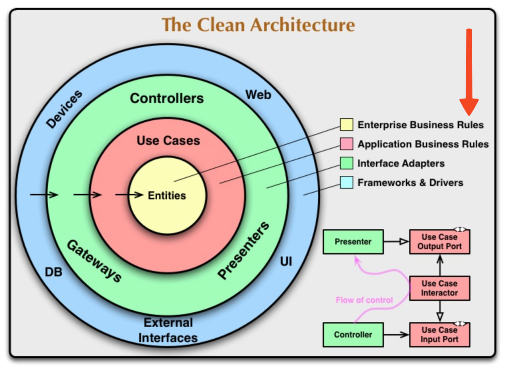
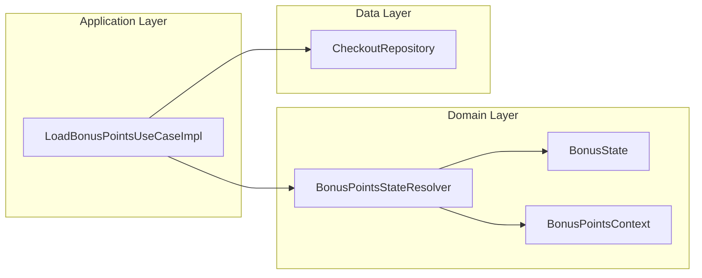
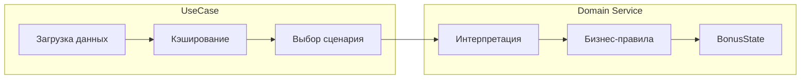
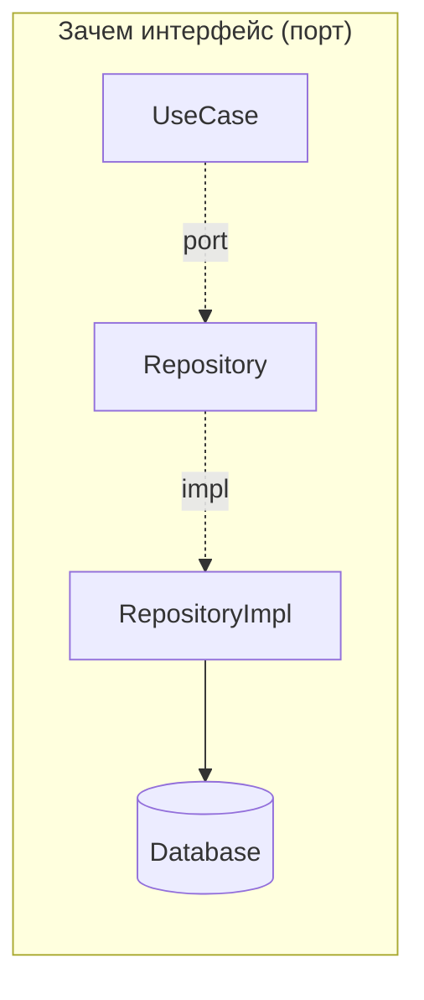
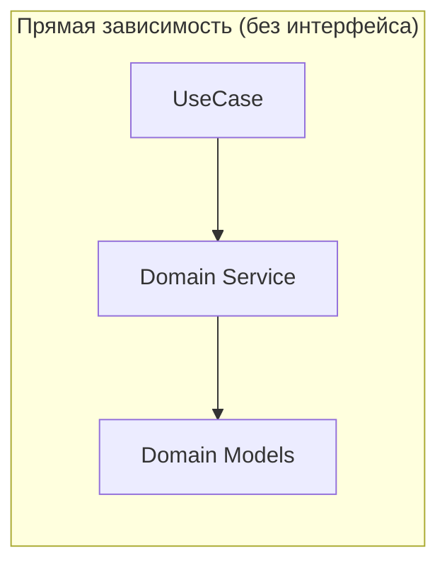
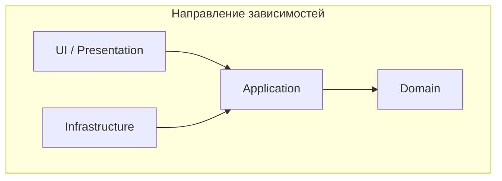
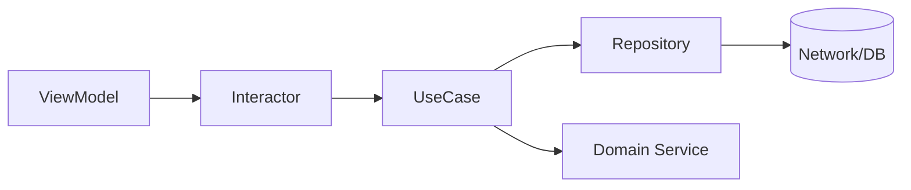
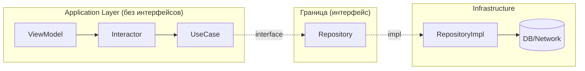
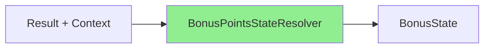
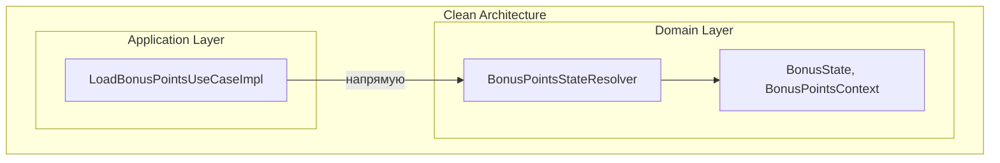

# Архитектура блока бонусных баллов: UseCase + Domain Service

## Clean Architecture (Robert C. Martin)

[](https://blog.cleancoder.com/uncle-bob/2012/08/13/the-clean-architecture.html)

> Источник: [The Clean Architecture — Uncle Bob, 2012](https://blog.cleancoder.com/uncle-bob/2012/08/13/the-clean-architecture.html)

---

## Контекст

В модуле `checkout/shared` реализована загрузка и интерпретация состояния бонусных баллов:

- `LoadBonusPointsUseCaseImpl` — Use Case (Application Layer)
- `BonusPointsStateResolver` — Domain Service (Domain Layer)

Цель документа — объяснить **почему** выделен отдельный Domain Service и **почему** ему не нужен интерфейс.

---

## Clean Architecture: два слоя бизнес-правил

На диаграмме Clean Architecture видно два слоя бизнес-правил:

| Слой | Цвет | Ответственность |
|------|------|-----------------|
| **Enterprise Business Rules** | жёлтый (Entities) | Чистые бизнес-правила, не зависящие от приложения |
| **Application Business Rules** | красный (Use Cases) | Оркестрация, специфичная для приложения |

В нашем случае:



---

## Разделение ответственностей

### LoadBonusPointsUseCaseImpl (Application Layer)

**Отвечает на вопросы: ЧТО и КОГДА**

- Решает, какие сетевые вызовы делать (параллельно или последовательно)
- Управляет кэшем результатов (`cachedIncreaseAmount`, `cachedDecreaseAmount`)
- Проверяет конфигурацию фичи (`loyaltyProgram`)
- Резолвит страну пользователя для определения лимитов
- Выбирает сценарий: `resolveInitialState` vs `resolveAction`

### BonusPointsStateResolver (Domain Service)

**Отвечает на вопрос: КАК интерпретировать**

- Преобразует `Result<BigDecimal>` в `BonusState`
- Содержит бизнес-правила: «минимум достигнут?», «лимит превышен?», «какую ошибку показать?»
- Нет побочных эффектов, нет состояния, нет IO



---

## Нужен ли резолверу интерфейс?

### Зачем вообще нужны интерфейсы в Clean Architecture?

Прежде чем ответить на вопрос про резолвер, разберёмся — какую проблему решают интерфейсы:

1. **Dependency Inversion** — внутренний слой (domain/application) не должен зависеть от внешнего (data/infrastructure). Но ему нужны данные из БД/сети. Решение: domain объявляет *порт* (интерфейс), а data предоставляет *адаптер* (реализацию).

2. **Подмена в тестах** — если класс делает IO (сеть, БД, файлы), в тестах мы хотим подставить мок. Интерфейс позволяет это сделать.

3. **Полиморфизм** — несколько реализаций одного контракта (разные провайдеры, стратегии, A/B тесты).



**Ключевое**: интерфейс нужен, когда зависимость **пересекает границу слоёв** или когда **нужна подмена реализации**.

### Применим критерии к BonusPointsStateResolver

| Критерий | Repository | BonusPointsStateResolver |
|----------|------------|--------------------------|
| Пересекает границу слоёв? | Да (application → data) | Нет (application → domain) |
| Делает IO? | Да (сеть/БД) | Нет (чистые вычисления) |
| Нужна подмена в тестах? | Да (мокаем сеть) | Нет (передаём реальный объект) |
| Несколько реализаций? | Возможно | Нет |

Резолвер:
- живёт **внутри домена** — нет пересечения границ наружу
- не делает IO — **детерминированные вычисления**
- тестируется напрямую — передаём `Result` на вход, проверяем `BonusState` на выходе



### Как выглядит тест без мока

```kotlin
@Test
fun `eligibleBelowMax returns MinimumNotReached when decreaseAmount below threshold`() {
    // Создаём реальный объект, не мок
    val resolver = BonusPointsStateResolver(minSpendingAmount = BigDecimal.TEN)

    val state = resolver.eligibleBelowMax(
        context = testContext,
        decreaseResult = Result.success(BigDecimal.fromInt(5)),
        increaseResult = Result.success(BigDecimal.fromInt(100)),
    )

    assertTrue(state is BonusState.MinimumNotReached)
}
```

Интерфейс добавил бы косвенность без пользы — мы и так передаём реальный объект.

### Почему домен — особый случай

Вернёмся к **Dependency Inversion Principle** (буква D в SOLID):

> Модули верхнего уровня не должны зависеть от модулей нижнего уровня. Оба должны зависеть от абстракций.

В Clean Architecture это работает так:
- **Application** (верхний) не должен зависеть от **Infrastructure** (нижний) → нужен интерфейс (порт)
- **Application** зависит от **Domain** — но Domain это не "нижний уровень", это **ядро**



Domain — центр системы, от которого зависят все остальные слои. Это не внешняя зависимость, которую нужно инвертировать. Это **ядро**, к которому всё стремится.

**Интерфейсы нужны для инверсии зависимостей на границах:**
- application → infrastructure (Repository, API Client)
- application → external systems (Payment Gateway, Notification Service)

**Интерфейсы не нужны внутри ядра:**
- Domain Service — часть домена, не пересекает границу
- Содержит бизнес-правила — они стабильны (меняются только при изменении бизнеса)
- Не делает IO — изолировать в тестах нечего

### А если A/B тесты?

Справедливый вопрос: что если понадобится A/B тест с разной логикой резолвинга?

**Ответ**: A/B тесты редко затрагивают бизнес-правила. Обычно тестируют:
- UI/UX (другой дизайн, другой текст)
- Порядок шагов (другой flow)
- Технические детали (другой API endpoint)

Бизнес-правила («минимум 50 баллов для списания», «лимит баланса 5000») — это не то, что A/B тестируют. Это требования бизнеса, они едины для всех пользователей.

Если же появится реальная потребность в разных стратегиях резолвинга — тогда и выделим интерфейс. Но это будет осознанное решение под конкретную задачу, а не "интерфейс на всякий случай".

### Вывод

Сигнатуры методов резолвера (`eligibleBelowMax`, `restoredIncrease` и т.д.) — это и есть контракт. Интерфейс продублировал бы их без добавления ценности, потому что:

1. **Нет инверсии зависимостей** — домен не зависит от внешних слоёв
2. **Нет подмены в тестах** — детерминированная логика тестируется напрямую
3. **Нет полиморфизма** — бизнес-правила едины для всех пользователей

---

## Интерфейсы во всей цепочке: ViewModel → Interactor → UseCase → ...

Рассмотрим вопрос системно: нужны ли интерфейсы на каждом уровне?



### Когда интерфейс нужен?

| Компонент | Интерфейс | Причина |
|-----------|-----------|---------|
| **Repository** | Да | Делает IO — в тестах мокаем, чтобы не ходить в сеть |
| **API Client** | Да | Делает IO — аналогично |
| **UseCase** | Обычно нет | Не делает IO, тестируется через мок Repository |
| **Interactor** | Обычно нет | Не делает IO, тестируется через мок Repository |
| **ViewModel** | Обычно нет | Конечная точка, тестируется через мок Repository |
| **Domain Service** | Обычно нет | Чистые вычисления, тестируется напрямую |

**Ключевой критерий**: делает ли компонент IO (сеть, БД, файлы)?
- Да → интерфейс нужен для изоляции в тестах
- Нет → интерфейс опционален

### Зачем мокать UseCase в тесте Interactor'а?

Частый аргумент: "нужен интерфейс UseCase, чтобы мокать его в тесте Interactor'а".

Но подумаем: **что мы тестируем?**

```
Interactor:
├── вызывает UseCase A
├── вызывает UseCase B
└── комбинирует результаты
```

Если мокаем UseCase A и B — мы тестируем только "склейку". Но реальные баги чаще в логике UseCase, а не в склейке.

**Лучший подход**: мокать только границу с IO (Repository), использовать реальные UseCase.

```kotlin
// Плохо: мокаем UseCase
@Test
fun interactorTest() {
    val useCaseA = mockk<UseCaseA>()  // Зачем?
    val useCaseB = mockk<UseCaseB>()  // Зачем?
    every { useCaseA.invoke() } returns ...
    // Тестируем только склейку, не реальное поведение
}

// Лучше: мокаем только Repository
@Test
fun interactorTest() {
    val repository = mockk<Repository>()  // Граница с IO
    val useCaseA = UseCaseAImpl(repository)  // Реальная логика
    val useCaseB = UseCaseBImpl(repository)  // Реальная логика
    val interactor = Interactor(useCaseA, useCaseB)
    // Тестируем реальное поведение
}
```

### А ViewModel?

ViewModel — конечная точка. От неё никто не зависит (кроме UI, который не тестируем unit-тестами).

Интерфейс для ViewModel не нужен, потому что:
- Некому её подменять
- В тестах ViewModel мокаем Interactor/UseCase? — Нет, лучше мокать Repository

### Принцип

**Мокай границу, не внутренности.**



---

## Преимущества текущего решения

### Тестируемость

| Компонент | Что нужно для теста |
|-----------|---------------------|
| `BonusPointsStateResolver` | Только входные данные (`Result`, `Context`) |
| `LoadBonusPointsUseCaseImpl` | Моки: `CheckoutRepository`, `UserSession`, `ConfigFeatureInteractor` |

Резолвер покрывается unit-тестами за минуты. UseCase требует интеграционного подхода.

### Single Responsibility

```
LoadBonusPointsUseCaseImpl:
├── Проверка конфига
├── Проверка авторизации
├── Резолвинг страны → лимиты
├── Загрузка decrease/increase
├── Кэширование результатов
└── Делегирование интерпретации → Resolver

BonusPointsStateResolver:
└── Интерпретация Result → BonusState
```

### Читаемость

Все правила «когда показать ошибку», «когда Normal», «когда MaximumReaching» сосредоточены в одном файле, а не размазаны по UseCase.

### Чистота функций

Резолвер **детерминированный**: одинаковые входы → одинаковый выход.



Нет: сетевых вызовов, мутаций состояния, зависимостей на время/рандом.

---

## Итого

| Вопрос | Ответ |
|--------|-------|
| Зачем выделен `BonusPointsStateResolver`? | Разделение оркестрации (UseCase) и бизнес-правил (Domain Service) |
| Почему без интерфейса? | Не пересекает границу слоёв, не требует подмены, тестируется напрямую |
| Где граница? | UseCase знает **что/когда**, резолвер знает **как интерпретировать** |


