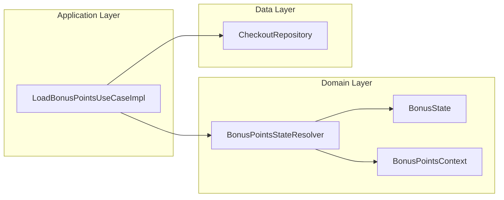
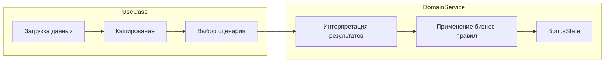
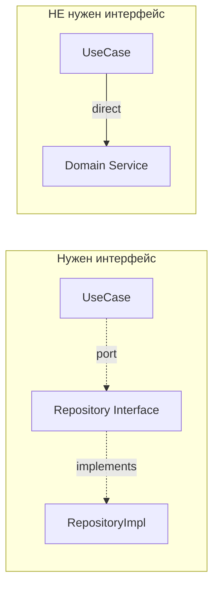
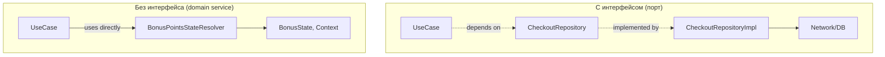
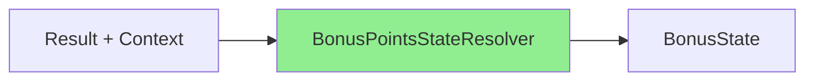
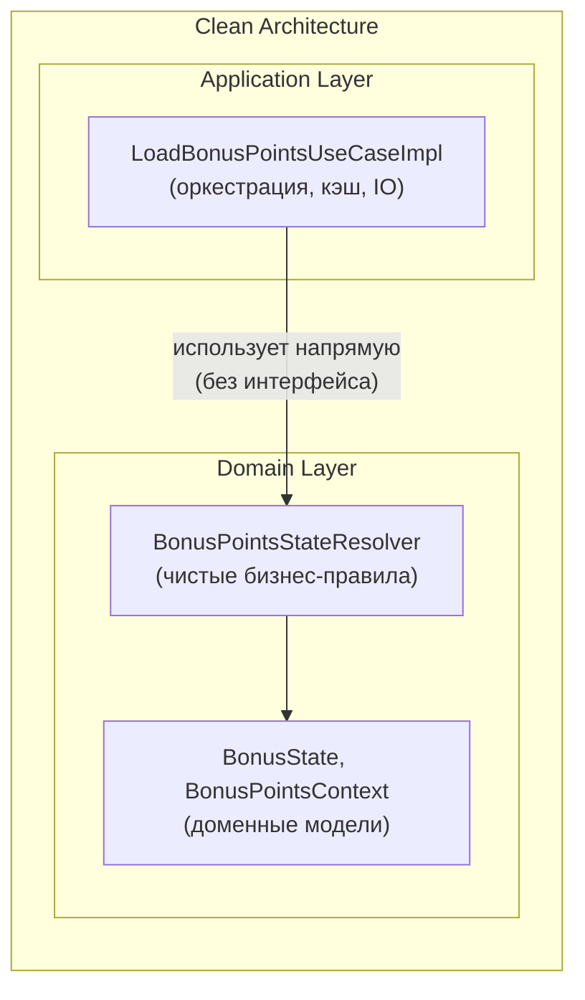

# Архитектура блока бонусных баллов: UseCase + Domain Service

## Clean Architecture (Robert C. Martin)

[](https://blog.cleancoder.com/uncle-bob/2012/08/13/the-clean-architecture.html)

> Источник: [The Clean Architecture — Uncle Bob, 2012](https://blog.cleancoder.com/uncle-bob/2012/08/13/the-clean-architecture.html)

---

## Контекст

В модуле `checkout/shared` реализована загрузка и интерпретация состояния бонусных баллов:

- `LoadBonusPointsUseCaseImpl` — Use Case (Application Layer)
- `BonusPointsStateResolver` — Domain Service (Domain Layer)

Цель документа — объяснить **почему** выделен отдельный Domain Service и **почему** ему не нужен интерфейс.

---

## Clean Architecture: два слоя бизнес-правил



| Слой | Ответственность | Пример |
|------|-----------------|--------|
| **Enterprise Business Rules** | Чистые бизнес-правила, не зависящие от приложения | `BonusPointsStateResolver` |
| **Application Business Rules** | Оркестрация, специфичная для приложения | `LoadBonusPointsUseCaseImpl` |

---

## Разделение ответственностей

### LoadBonusPointsUseCaseImpl (Application Layer)

**Отвечает на вопросы: ЧТО и КОГДА**

- Решает, какие сетевые вызовы делать (параллельно или последовательно)
- Управляет кэшем результатов (`cachedIncreaseAmount`, `cachedDecreaseAmount`)
- Проверяет конфигурацию фичи (`loyaltyProgram`)
- Резолвит страну пользователя для определения лимитов
- Выбирает сценарий: `resolveInitialState` vs `resolveAction`

### BonusPointsStateResolver (Domain Service)

**Отвечает на вопрос: КАК интерпретировать**

- Преобразует `Result<BigDecimal>` в `BonusState`
- Содержит бизнес-правила: «минимум достигнут?», «лимит превышен?», «какую ошибку показать?»
- Нет побочных эффектов, нет состояния, нет IO



---

## Почему резолверу НЕ нужен интерфейс

### 1. Это не порт/адаптер — это чистая логика

Интерфейсы в Clean Architecture нужны для:

- **Инверсии зависимостей** — когда внутренний слой зависит от внешнего (Repository, Gateway)
- **Подмены реализации** — когда есть несколько стратегий или нужен мок для тестов

`BonusPointsStateResolver` — это **чистые вычисления внутри домена**. Он не зависит от внешних слоёв, его не нужно подменять.



### 2. Тестируется напрямую без моков

```kotlin
// Резолвер — чистая функция, тестируется без DI/моков
@Test
fun `eligibleBelowMax returns MinimumNotReached when decreaseAmount below threshold`() {
    val resolver = BonusPointsStateResolver(minSpendingAmount = BigDecimal.TEN)

    val state = resolver.eligibleBelowMax(
        context = testContext,
        decreaseResult = Result.success(BigDecimal.fromInt(5)),
        increaseResult = Result.success(BigDecimal.fromInt(100)),
    )

    assertTrue(state is BonusState.MinimumNotReached)
}
```

Интерфейс добавил бы косвенность без пользы — мы и так передаём реальный объект.

### 3. Нет полиморфизма

Резолвер один. Нет:

- разных стратегий резолвинга
- A/B тестов с разной логикой
- платформенных различий

Интерфейс «на будущее» — это преждевременная абстракция (YAGNI).

### 4. Стабильный контракт

Сигнатуры методов резолвера (`eligibleBelowMax`, `restoredIncrease` и т.д.) — это и есть контракт. Интерфейс просто продублировал бы эти сигнатуры.

---

## Сравнение: когда интерфейс нужен vs не нужен

| Критерий | Интерфейс нужен | Интерфейс НЕ нужен |
|----------|-----------------|---------------------|
| Зависимость от внешнего слоя | Repository, API Client | Domain Service |
| Нужна подмена в тестах | Да (мок сети/БД) | Нет (чистые вычисления) |
| Несколько реализаций | Strategy, разные провайдеры | Одна логика |
| Инверсия зависимостей | Domain → Data (через порт) | Domain → Domain (напрямую) |



---

## Преимущества текущего решения

### 1. Тестируемость

| Компонент | Что нужно для теста |
|-----------|---------------------|
| `BonusPointsStateResolver` | Только входные данные (`Result`, `Context`) |
| `LoadBonusPointsUseCaseImpl` | Моки: `CheckoutRepository`, `UserSession`, `ConfigFeatureInteractor` |

Резолвер покрывается unit-тестами за минуты. UseCase требует интеграционного подхода.

### 2. Single Responsibility

```
LoadBonusPointsUseCaseImpl:
├── Проверка конфига
├── Проверка авторизации
├── Резолвинг страны → лимиты
├── Загрузка decrease/increase (параллельно или нет)
├── Кэширование результатов
└── Делегирование интерпретации → BonusPointsStateResolver

BonusPointsStateResolver:
└── Интерпретация Result → BonusState по бизнес-правилам
```

### 3. Читаемость

Все правила «когда показать ошибку», «когда Normal», «когда MaximumReaching» сосредоточены в одном файле (332 строки), а не размазаны по UseCase.

### 4. Чистота функций

Резолвер **детерминированный**: одинаковые входы → одинаковый выход.



Нет:

- сетевых вызовов
- мутаций состояния
- зависимостей на время/рандом

---

## Итого

| Вопрос | Ответ |
|--------|-------|
| Зачем выделен `BonusPointsStateResolver`? | Разделение оркестрации (UseCase) и бизнес-правил (Domain Service) |
| Почему без интерфейса? | Это не порт, не требует подмены, тестируется напрямую |
| Где граница? | UseCase знает **что/когда**, резолвер знает **как интерпретировать** |


